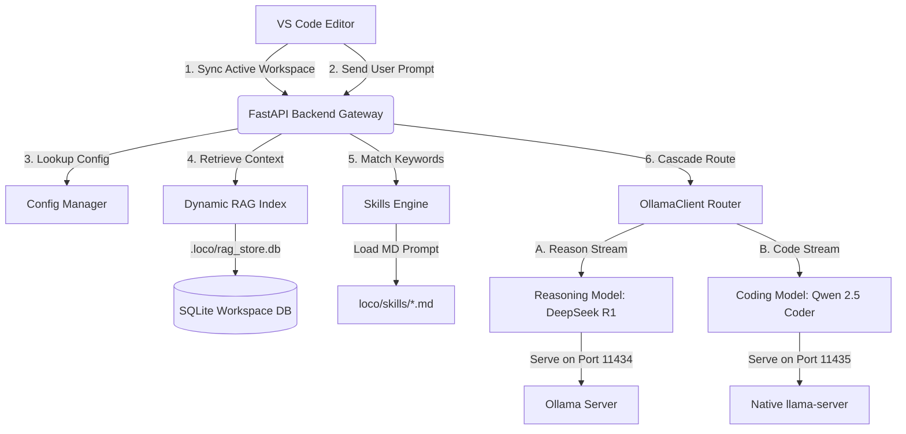

# LocoEngine 🚂 — Local AI Developer Gateway & Agent Cascade Router

LocoEngine is a lightweight, high-performance, and privacy-first AI Developer Gateway that links your local IDE (VS Code) to locally run Small/Large Language Models (SLMs/LLMs). It serves as a local proxy, hybrid RAG database, and autonomous agent orchestration loop built specifically for offline software engineering.

Unlike cloud-dependent AI extensions that compromise code privacy and incur high APIs costs, LocoEngine is designed to run **100% locally and offline**. It features strict **Workspace Isolation** to prevent source code leaks across projects, an advanced **Cascade Routing** system to perform high-level reasoning prior to code generation, and **Hardware Gating** to ensure local models run within physical resource constraints without crashing.

---

## 🎨 Core Architectural Pillars (Why Use LocoEngine?)

There are dozens of generic "Copilot" integrations. LocoEngine sets itself apart by targeting the needs of enterprise, security-sensitive, and local-first software development:

### 1. Zero-Data-Bleed Workspace Isolation
Traditional AI assistants persist a global history or sharing memory space across your machine. LocoEngine introduces true workspace separation:
* **Active Workspace Tracking**: When you change your project workspace folder in VS Code, the extension automatically sends a sync alert to the backend.
* **On-the-Fly Database Migration**: The backend dynamically detaches the SQLite memory database from the old path and mounts a fresh database inside the new active folder under `.loco/rag_store.db`.
* **Private State**: Embedded chunks, custom uploaded documents, crawled API reference URLs, and prompt histories are isolated strictly within each project's directory. No cross-project context leakage is physically possible.

### 2. Native Dual-Routing: Ollama + llama.cpp
Choose how you serve your models. LocoEngine works as:
* **An Ollama Gateway**: Connects directly to a running Ollama container/service on standard port `11434`.
* **A Native Llama.cpp Runner**: Features built-in binary downloading, model management, and model hosting using `llama-server.exe` on port `11435`.

### 3. Hardware-Gated Safety Filters
Local execution risks Out-Of-Memory (OOM) lockups if you try to load models too large for your CPU/GPU. LocoEngine profiles the host system on-the-fly:
* **Disk Space**: Ensures enough space is available inside the target folder.
* **RAM & VRAM Gating**: Evaluates physical memory and NVIDIA GPU VRAM (using `nvidia-smi` query APIs).
* **Prevention**: Blocks downloads and execution if the model size exceeds 70% of available memory limits.

### 4. Cascade Routing: Split Reasoning & Coding
Standard SLMs struggle to solve complex algorithmic tasks directly. LocoEngine uses a dual-pass Cascade Router:
* **Reasoning Pass**: Prompts a reasoning model (like `deepseek-r1:1.5b`) to outline the algorithmic approach, generating step-by-step thoughts wrapped inside `<think>...</think>` tags.
* **Coding Pass**: Chains the reasoning output and original context into a fast, specialized coding model (like `qwen2.5-coder:1.5b`) to construct clean, syntax-checked code blocks.

### 5. RRF-Based Hybrid RAG Search
Rather than relying solely on semantic vector matches which can fetch irrelevant code snippets, LocoEngine implements **Reciprocal Rank Fusion (RRF)**:
* **Vector Cosine Similarity**: Computes cosine similarity of high-dimensional embeddings using a local embedding model.
* **Keyword Density Match**: Scrapes code structures for exact lexical keywords.
* **Fusion Ranker**: Ranks candidate chunks using $RRF(d) = \sum_{m \in M} \frac{1}{60 + r_m(d)}$ to fetch highly accurate context snippets.

### 6. Dynamic Skill Injection
Preloaded with 20+ specialized Markdown agent skills parsed from Anthropic's developer registry (e.g., `code_review`, `unit_test`, `optimize`, `webapp-testing`). Prompts are checked against trigger keywords to inject specialized instructions directly into the system prompts.

---

## 🏗️ System Architecture & Data Flow



---

## 🚀 Installation & Build Setup

### Prerequisites
* **Python**: Version `3.10` or higher.
* **Node.js & npm**: Installed for building the VS Code extension.
* **C++ Compiler (Optional)**: If you build llama.cpp custom, though LocoEngine downloads precompiled Windows AVX2 binaries automatically.

### 1. Setting Up the Backend API

1. Navigate to the project root directory:
   ```bash
   cd loco
   ```
2. Create and activate a virtual environment:
   ```bash
   python -m venv .venv
   # Windows:
   .venv\Scripts\activate
   # Linux/macOS:
   source .venv/bin/activate
   ```
3. Install dependencies:
   ```bash
   pip install -r requirements.txt
   ```
4. Start the LocoEngine API server:
   ```bash
   python main.py
   ```
   *The server will host the admin dashboard on `http://127.0.0.1:8000/` and open-compatible API endpoints on `http://127.0.0.1:8000/v1`.*

Alternatively on Windows, you can double-click the preconfigured `run.bat` file in the root directory to automatically launch the server in a separate terminal window.

---

### 2. Building the VS Code Extension

1. Navigate to the extension source folder:
   ```bash
   cd vscode-ext
   ```
2. Install dependencies:
   ```bash
   npm install
   ```
3. Compile the extension using the esbuild bundler script:
   ```bash
   npm run build
   ```
4. Package the extension into an installable `.vsix` file (Optional):
   ```bash
   npx vsce package
   ```
   This will generate a `locoengine-vscode-1.0.0.vsix` file which you can load by dragging and dropping it into VS Code, or running `VS Code: Install from VSIX...` from the command palette.

---

### 3. Importing and Testing in VS Code (Development Mode)

If you are developing or testing changes:
1. Open the `vscode-ext` directory in a new VS Code window.
2. Open the file `src/extension.ts` or press `F5` on your keyboard.
3. This opens a **[Extension Development Host]** window.
4. The LocoEngine sidebar activity container (Robot icon 🤖) will appear in the left-hand panel.
5. Make sure the backend server is running (`python main.py`), open any folder in the development host, and watch the extension synchronize the active workspace path automatically!

---

## 🛠️ Operating Concepts & UI Features

### 💻 Sidebar User Interface (UX)

The LocoEngine Sidebar panel provides all tools needed to control your offline AI assistant:

* **Prompts Input Panel**: A text input area supporting multiline code pasting and system commands.
* **Model Selection Selector**: Located in the footer. Set it to `Auto Select` to use the Cascade dual-router, or manually choose a single model (Ollama models or loaded GGUF servers).
* **RAG Custom Indexing Panel**:
  * **File Upload**: Select any custom documentation, specification, or code file. The backend will parse, chunk, and index it into RAG.
  * **URL Scraper**: Paste a URL (e.g., API documentation). The gateway fetches the page, sanitizes HTML, and embeds the text context dynamically.
* **History Tab (⏳)**: A persistent session viewer saved in VS Code's local storage (isolated per workspace). Rehydrate past conversations instantly.
* **Settings Overlay (⚙️)**: Configures server endpoints, turns RAG/Cascade options on or off, checks CPU/GPU status, and operates the llama.cpp server:
  * **Sync Skills**: Synchronizes your local skills directory with official Anthropic repository templates.
  * **Download**: Downloads GGUF model files (automatically resource-gated).
  * **Manage Servers**: Starts or stops local instances of `llama-server.exe`.

### 🛡️ Human-in-the-Loop Command Execution (HITL)

When LocoEngine runs in **Agent Mode**, it functions as an autonomous agent. When it decides to execute a system command (e.g. running tests, creating directories, deleting temp files):
1. The backend pauses execution and registers a pending approval request.
2. The VS Code sidebar displays a warning banner highlighting the exact shell script command.
3. The user can review the request and click **Approve** or **Reject**.
4. The backend resumes execution with the shell results or skips the step safely based on your feedback.

---

## 🚀 Hosting & Production Deployment

If you want to host LocoEngine centrally for multiple developer workstations:

### 1. LAN/Server Deployment
Modify the configuration file `config.json` to listen on your network interface rather than localhost loopback:
```json
{
    "host": "0.0.0.0",
    "port": 8000,
    "ollama_url": "http://10.0.0.50:11434"
}
```
Deploy the backend on a high-spec server hosting shared GPUs. Developers can configure their VS Code extensions' `Server URL` settings (in `vscode-ext` settings or `.vscode/settings.json`) to point to the central IP address (e.g. `http://10.0.0.50:8000`).

### 2. Docker Deployment
You can package the backend as a container. Create a `Dockerfile` in the root:
```dockerfile
FROM python:3.10-slim
WORKDIR /app
COPY requirements.txt .
RUN pip install --no-cache-dir -r requirements.txt
COPY . .
EXPOSE 8000
CMD ["python", "-m", "loco.main"]
```
Run the container:
```bash
docker build -t locoengine-backend .
docker run -d -p 8000:8000 -v /path/to/shared/workspaces:/workspaces locoengine-backend
```

---

## 🔍 Code Review & Verification

LocoEngine includes a self-verification suite to test syntax correctness, folder integrity, and component functionality:
```bash
python verify_gateway.py
```
This script tests:
1. **Workspace Layout**: Verifies that all HTML/JS assets and built-in markdown skills exist.
2. **Syntax Compilation**: Performs structural compilation on all python backend scripts.
3. **ConfigManager Unit Tests**: Verifies read/write behavior on JSON files.
4. **Chunker Unit Tests**: Verifies code-aware logical chunk boundaries.
5. **RAG Reciprocal Rank Fusion**: Simulates search index matching using vector mock objects.
